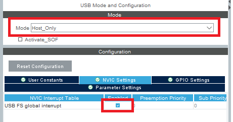
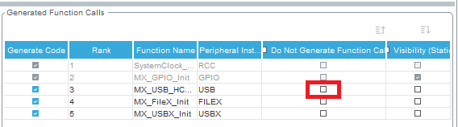

# Ux_Host_MSC_Standalone, step by step

## Introduction, prerequisites
- As current (v6.14.0) CubeMX does not generate code that works off-the-shelf for Standalone USBX MSC, there is this guide
- NUCLEO-H563ZI is assumed as target, there is simple modification to be applied:
    - adding jumper to "USB USER" position of JP6 (as workaround) 
- Beneficial is beginning the CubeIDE project for NUCLEO-H563ZI (as it already includes pin definition and VCP)

## Basic example settings
### CubeMX Pinout tab (what to set)

- By "FileX" only set the "Core" and "Custom Interface"


- By "RCC" should be set "BYPASS" as clock HSE (for USB host, HSI48 is not enough accurate to meet the standard)


- By "USB" set "Host Only" and enable interrupt


- By **USBX** enable **Core**,  **CoreStack**, **Controllers** and **MSC** class
    - Set **UXHost memory pool size** to 48 kB, set stack size to 24 kB

    

    - In **Platform Settings** select **USB** peripheral

    

### CubeMX Clock tab
- It is need to use HSE for accurate clock


- Use PLL3 for getting 48 MHz


### CubeMX Project Manager tab
- Please check that all the initializations should be generated (uncheck checkboxes, especially `MX_USB_HCD_Init()`)



### CubeIDE main.c changes
- Include `#include "ux_hcd_stm32.h"`
- To `USER CODE` includes section add
```C
/* USER CODE BEGIN Includes */
#include "ux_hcd_stm32.h"
/* USER CODE END Includes */
```

- To `USER CODE 2` section fill
```C
/* USER CODE BEGIN 2 */
  ux_host_stack_hcd_register(_ux_system_host_hcd_stm32_name,
                               _ux_hcd_stm32_initialize, (ULONG)USB_DRD_FS,
                               (ULONG)&hhcd_USB_DRD_FS);
  HAL_HCD_Start(&hhcd_USB_DRD_FS);
  /* USER CODE END 2 */
```
- To `USER CODE 3` section add `ux_host_stack_tasks_run();` to run the USB operation.
```C
/* USER CODE BEGIN 3 */
ux_host_stack_tasks_run(); //periodic refresh of USB
}
/* USER CODE END 3 */
```

### CubeIDE app_usbx_host.c changes
- In UsbX is missing definition of ms delay – HAL tick (systick) may be used
- Add to `_ux_utility_time_get()` 
```C
/* USER CODE BEGIN _ux_utility_time_get */
time_tick = HAL_GetTick();
/* USER CODE END _ux_utility_time_get */
```

*Now when running the program, `ux_host_event_callback()` should be entered when MSC device is connected, the USBX stack should be working*

## Making the actual example

Problem with the standalone version of USBX/FileX is that these components cannot be simply linked together, therefore it is necessary to implement a custom driver. For using an example it is useful to add the actual file operation -- based on [Ux_Host_MSC example](https://github.com/STMicroelectronics/STM32CubeH5/tree/main/Projects/STM32H573I-DK/Applications/USBX/Ux_Host_MSC) form [STM32CubeH5 package](https://www.st.com/en/embedded-software/stm32cubeh5.html).

### USBX part: app_usbx_host.c
- Most of the code from original example may be reused
    - For prints may be used `printf()`
    - As signal for `main()` is used `STORAGE_MEDIA`

After includes should be added:
```C
/* USER CODE BEGIN Includes */

uint8_t STORAGE_MEDIA =0;
UX_HOST_CLASS_STORAGE       *storage;

#ifndef USBH_UsrLog
#define USBH_UsrLog printf
#endif

#include "fx_stm32_custom_driver.h"
FX_MEDIA usb_disk= {};

/* USER CODE END Includes */
```

In ux_host_event_callback()


```C
/* USER CODE BEGIN UX_DEVICE_INSERTION */
/* Get current Storage Class */
if (current_class -> ux_host_class_entry_function == ux_host_class_storage_entry)
{
    if (storage == UX_NULL)
    {
        /* Get current Storage Instance */
        storage = (UX_HOST_CLASS_STORAGE *)current_instance;

        USBH_UsrLog("\nUSB Mass Storage Device Plugged");
        USBH_UsrLog("PID: %#x ", (UINT)storage -> ux_host_class_storage_device -> ux_device_descriptor.idProduct);
        USBH_UsrLog("VID: %#x ", (UINT)storage -> ux_host_class_storage_device -> ux_device_descriptor.idVendor);
        USBH_UsrLog("\n");

        /* Get the storage media */
        if (((UX_HOST_CLASS_STORAGE_MEDIA *)current_class -> ux_host_class_media) -> ux_host_class_storage_media_lun != 0)
        {
            storage = UX_NULL;
        }
        else
        {
            STORAGE_MEDIA = 1;

        }
    }
}
/* USER CODE END UX_DEVICE_INSERTION */
```

And for the case of device removal add:
```C
/* USER CODE BEGIN UX_DEVICE_REMOVAL */
if ((VOID*)storage == current_instance)
{
    /* Clear storage instance */
    storage = UX_NULL;
    USBH_UsrLog("\nUSB Mass Storage Device Unplugged\n");
}
/* USER CODE END UX_DEVICE_REMOVAL */
```

### Connecting USBX and FileX -- Custom driver part
For connecting USBX and FileX is for standalone scenario necessary to with a custom driver. For a custom project, please take the following files (`fx_stm32_custom_driver.h/.c`) form this repository.


### Application part `main.c`
-– `main()` need to be modified, firstly there are includes and FileX media buffer. 
``` C
/* USER CODE BEGIN Includes */
#include "ux_hcd_stm32.h"

extern uint8_t STORAGE_MEDIA;
extern void msc_process();

UINT media_memory[2048 / sizeof(UINT)];
FX_MEDIA                    *media;
FX_MEDIA                    usb_media;
extern UX_HOST_CLASS_STORAGE       *storage;
/* USER CODE END Includes */
```

And to the `USER CODE 3` section add checking of the `STORAGE_MEDIA` flag with opening the media (as `UX_HOST_CLASS_STORAGE_NO_FILEX` is forced for standalone scenario) and calling `msc_process()` function (as in the original example).

``` C
    if(STORAGE_MEDIA != 0){
	 	media = &usb_media;
	 	/* Check the storage class state */
	  	if (storage -> ux_host_class_storage_state ==  UX_HOST_CLASS_INSTANCE_LIVE){
	  		for(int i = 0;i< sizeof(usb_media); ++i) ((uint8_t*)media)[i]=0;//delete usb_media
	  		STORAGE_MEDIA = 0;
	  		UINT ret = fx_media_open(media, "STM32_USB_DISK", fx_stm32_custom_driver, (VOID *) media->fx_media_driver_info, (VOID *) media_memory, sizeof(media_memory));
	  		if (! ret) msc_process();//start file operation
	  		}
	  	} 
```

### The rest of the example application

Beginning with `msc_process()` function, the rest of the application may be taken form the original example almost as is (form this point FileX stack should behave form user scope more-or-less identical to RTOS scenario). Following files may be copied (example of file operation):

 

### One caveat, partition formatting
With the example (as here presented) should work pen-drives FAT12/FAT16/FAT32 formatted (please check first, when you found issues with the example).

FileX supports exFAT (license from Microsoft for such needed (https://github.com/eclipse-threadx/filex/issues/65) as not being "Azure" anymore), this may be enabled in "fx_user.h" by uncommenting related macro

```C
#define FX_ENABLE_EXFAT
```

